# Documentação Forense Técnica Completa: OwlPlug

**Versão do Documento:** 1.0
**Data da Análise:** Março 2026
**Analista:** Arquiteto Sênior e Auditor de Segurança (Modo Forense Paranoico)
**Licença:** GNU General Public License v3

---

## Índice

1. [Visão Geral do Sistema](#1-visão-geral-do-sistema)
2. [Modelos C4 (Arquitetura)](#2-modelos-c4)
3. [Análise de Pontos de Entrada (Entry Points)](#3-análise-de-pontos-de-entrada-entry-points)
   - 3.1 [Inicialização da Aplicação: Bootstrap.main](#31-inicialização-da-aplicação-bootstrapmain)
   - 3.2 [Ciclo de Vida Spring: ApplicationMonitor.initialize](#32-ciclo-de-vida-spring-applicationmonitorinitialize)
   - 3.3 [Ciclo de Vida Spring: NativeHostService.init](#33-ciclo-de-vida-spring-nativehostserviceinit)
   - 3.4 [Ciclo de Vida Spring: ExploreService.init](#34-ciclo-de-vida-spring-exploreserviceinit)
   - 3.5 [Ciclo de Vida Spring: TelemetryService.initialize](#35-ciclo-de-vida-spring-telemetryserviceinitialize)
   - 3.6 [Interface de Usuário: MainController.initialize](#36-interface-de-usuário-maincontrollerinitialize)
   - 3.7 [Pós-Inicialização Manual: MainController.dispatchPostInitialize](#37-pós-inicialização-manual-maincontrollerdispatchpostinitialize)
   - 3.8 [Eventos Internos: MainController.onAccountChanged](#38-eventos-internos-maincontrolleronaccountchanged)
   - 3.9 [Execução de Tarefa Assíncrona: PluginScanTask.call](#39-execução-de-tarefa-assíncrona-pluginscantaskcall)
   - 3.10 [Execução de Tarefa Assíncrona: BundleInstallTask.call](#310-execução-de-tarefa-assíncrona-bundleinstalltaskcall)
   - 3.11 [Desligamento da Aplicação: ApplicationMonitor.shutdown](#311-desligamento-da-aplicação-applicationmonitorshutdown)
4. [Análises Adicionais](#4-análises-adicionais)

---

## 1. Visão Geral do Sistema

OwlPlug é um gerenciador de plugins de áudio baseado em Java para formatos VST, VST3, Audio Units (AU) e LV2. A aplicação opera primariamente como um aplicativo desktop, unindo uma camada de apresentação rica (JavaFX), injeção de dependência e controle transacional via Spring Boot, persistência local em banco de dados H2 embarcado e interações profundas com o sistema operacional e binários C++ nativos (JUCE) para varredura e extração de metadados de plugins.

Como um sistema de desktop que executa binários, baixa arquivos da internet e acessa o sistema de arquivos extensivamente, a superfície de ataque concentra-se em exploração de binários locais, injeção de caminhos e manipulação de credenciais armazenadas localmente. A arquitetura pressupõe confiança no ambiente do usuário local, o que demanda auditoria rigorosa das fronteiras de entrada e saída.

---

## 2. Modelos C4

### 2.1 System Context Diagram

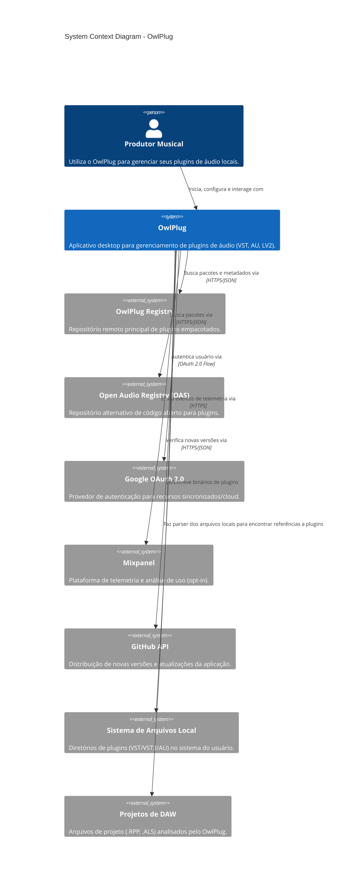

### 2.2 Container Diagram

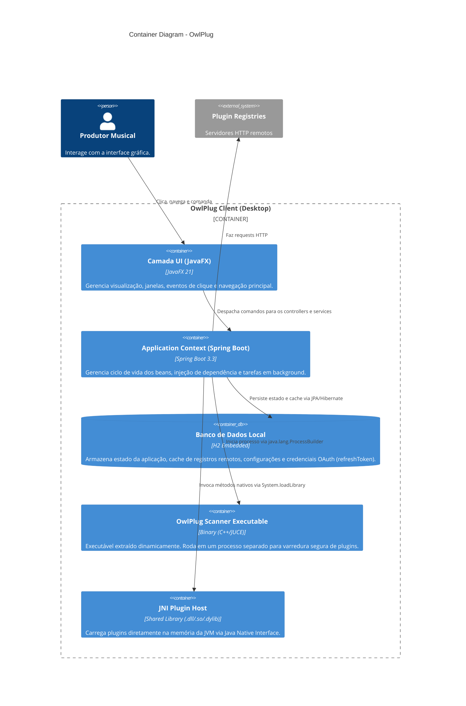

### 2.3 Component Diagram (owlplug-client & services)

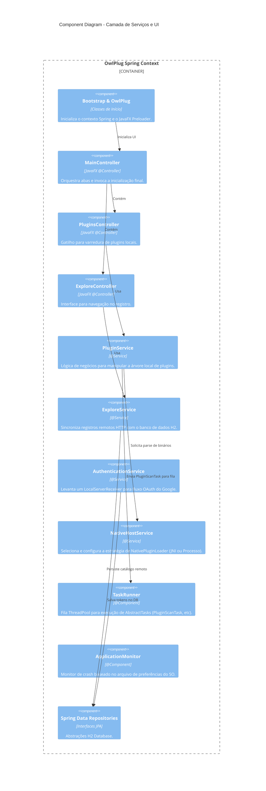

### 2.4 Code-level Structural Diagram (Native Loader Strategy)


---

## 3. Análise de Pontos de Entrada (Entry Points)

Nenhuma aplicação pode existir sem um ponto de acionamento inicial. A análise abaixo cataloga rigorosamente todos os pontos de entrada encontrados no código fonte, os mapeia em fluxogramas separados e rastreia em profundidade suas execuções.

### 3.1 Inicialização da Aplicação: Bootstrap.main

- **Localização Exata:** `/owlplug-client/src/main/java/com/owlplug/Bootstrap.java`
- **Nome da Classe:** `Bootstrap`
- **Assinatura do Método:** `public static void main(final String... args)`
- **Tipo de Gatilho:** Execução Explícita CLI / Desktop Shortcut (Processo Main da JVM).
- **Esquema de Entrada (Input Schema):** `String... args` - Argumentos de linha de comando arbitrários passados pelo sistema operacional.
- **Lógica de Validação:** Nenhuma validação feita nos argumentos na camada do método `main`.
- **Lógica de Segurança:** Ausente nesta etapa inicial. Todos os argumentos são passados cegamente para o Application.launch do JavaFX.
- **Chamadas de Serviços:** Não há chamadas a `@Service` ainda, pois o contexto Spring não existe.
- **Passos do Processamento Interno:**
  1. Chama `System.setProperty("javafx.preloader", getPreLoader())`. Essa etapa é vital para configurar o "Splash Screen" animado nativo do JavaFX antes da JVM começar o overhead de carregar o Spring.
  2. Invoca `javafx.application.Application.launch(OwlPlug.class, args)`. Isto entrega o controle do fio de execução principal para a Thread interna do JavaFX (Application Thread).
  3. Internamente, o JavaFX invocará `OwlPlug.init()`, onde o Spring Boot é de fato iniciado: `context = SpringApplication.run(Bootstrap.class, args)`.
- **Fluxos Condicionais:** Nenhum explícito nesta fase, o fluxo é totalmente sequencial.
- **Fluxos de Exceção:** 
  - Se a inicialização do Spring no método `OwlPlug.init()` falhar, ele captura `BeanCreationException`. Se a causa for um `HibernateException`, assume-se que há uma trava de lock no banco de dados H2 (o que implica que o OwlPlug já está rodando em outra janela).
  - É gerado um `notifyPreloader` informando erro no splash screen. A exceção é re-lançada, abortando o processo.
- **Lógica de Retentativa:** Nenhuma. Falha crítica.
- **Comportamento de Log:** Utiliza SLF4J (Logback) capturando `LOGGER.error` caso ocorram falhas de inicialização do contexto.
- **Limites Transacionais:** Não se aplica (Nenhum `@Transactional` aberto).
- **Interações com Banco de Dados:** Apenas implicado pela falha de aquisição do arquivo `~/.owlplug/db.mv.db` pelo Hibernate/H2.
- **Integrações Externas:** Nenhuma.
- **Eventos Emitidos:** Eventos de preloader via barramento do JavaFX.
- **Efeitos Colaterais:** Inicia uma instância inteira de um Contexto Spring Boot, ocupando portas, abrindo threads e efetuando locks em arquivos de log e banco de dados local.
- **Saídas Finais:** Abertura da janela principal (Stage) pelo método `OwlPlug.start()`.

**Rastreio do Processo (Process Trace):**
JVM Start -> `Bootstrap.main()` -> `System.setProperty` -> `Application.launch()` -> (JavaFX Thread) -> `OwlPlug.init()` -> `SpringApplication.run()` -> (Spring IoC Container Bootstrapped) -> Beans Injectados -> `OwlPlug.start()` -> Mostra a janela.

**Fluxograma:**

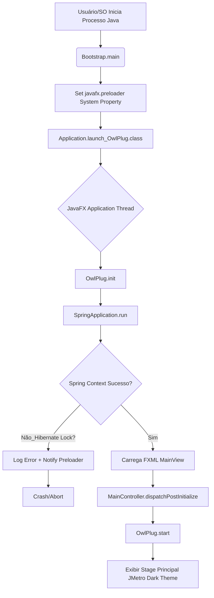

---

### 3.2 Ciclo de Vida Spring: ApplicationMonitor.initialize

- **Localização Exata:** `/owlplug-client/src/main/java/com/owlplug/core/components/ApplicationMonitor.java`
- **Nome da Classe:** `ApplicationMonitor`
- **Assinatura do Método:** `@PostConstruct public void initialize()`
- **Tipo de Gatilho:** Implícito (Framework Auto-configuration / Spring Bean Lifecycle). Disparado pelo Spring logo após injetar dependências do componente `@Component`.
- **Esquema de Entrada:** Vazio.
- **Lógica de Validação:** Nenhuma.
- **Lógica de Segurança:** Confia implicitamente no `java.util.prefs.Preferences` para leitura de estado. Pode ser manipulado por outros softwares na máquina.
- **Chamadas de Serviços:** Usa o `ApplicationPreferences` injetado (wrapper do `java.util.prefs`).
- **Passos do Processamento Interno:**
  1. Busca a preferência `APPLICATION_STATE_KEY` no sistema.
  2. Checa se o estado recuperado é exatamente igual a `RUNNING` (que significa que a aplicação não rodou até o seu shutdown de maneira limpa em um processo anterior).
  3. Se sim, marca a flag de instância `previousExecutionSafelyTerminated = false`.
  4. Caso contrário, marca como `true`.
  5. Atualiza (escreve no disco do SO) a preferência para `RUNNING` para a sessão atual.
- **Fluxos Condicionais:** Depende de estado global persistido fora da aplicação.
- **Fluxos de Exceção:** Sem catch block. Se falhar por permissão de I/O, propaga runtime exception na inicialização do Spring, quebrando o boot.
- **Lógica de Retentativa:** Nenhuma.
- **Comportamento de Log:** Silencioso nesta fase (logs ocorrem depois, ao despachar a notificação para a UI de recovery).
- **Limites Transacionais:** Fora do banco relacional, escreve nas preferências nativas do SO (ex: Windows Registry).
- **Interações com Banco de Dados:** Nenhuma.
- **Integrações Externas:** API nativa do Sistema Operacional.
- **Eventos Emitidos:** Nenhum evento Spring. Apenas mutação de estado de objeto.
- **Efeitos Colaterais:** Modifica chave de registro global no sistema do usuário para sinalizar que o OwlPlug "está em execução". Se outro processo checar a chave simultaneamente (Race Condition), há risco de colisão.
- **Saídas Finais:** Estado interno alterado e chave persistida.

**Rastreio do Processo:**
Spring Instancia `ApplicationMonitor` -> Dispara `@PostConstruct` -> Lê estado anterior OS Registry -> Atualiza Registry para `RUNNING`.

**Fluxograma:**

```mermaid
flowchart TD
    A[Spring Bean Factory] --> B[ApplicationMonitor.constructor]
    B --> C[@PostConstruct initialize]
    C --> D[Lê preferência APPLICATION_STATE_KEY]
    D --> E{Estado == RUNNING?}
    E -- Sim_Crash Anterior Detectado --> F[set previousSafelyTerminated = false]
    E -- Não_Normal --> G[set previousSafelyTerminated = true]
    F --> H
    G --> H[Escreve preferência = RUNNING]
    H --> I[Fim Inicialização]
```

---

### 3.3 Ciclo de Vida Spring: NativeHostService.init

- **Localização Exata:** `/owlplug-client/src/main/java/com/owlplug/plugin/services/NativeHostService.java`
- **Nome da Classe:** `NativeHostService`
- **Assinatura do Método:** `@PostConstruct public void init()`
- **Tipo de Gatilho:** Implícito (Spring Bean Lifecycle).
- **Esquema de Entrada:** Vazio.
- **Lógica de Segurança:** Crítico. Inicializa carregadores de código nativo C/C++ que podem comprometer a memória ou o sistema de arquivos se manipulados.
- **Passos do Processamento Interno:**
  1. Instancia `EmbeddedScannerPluginLoader`, `JNINativePluginLoader` e `DummyPluginLoader`.
  2. Adiciona todos eles numa lista interna.
  3. Itera sobre cada loader e chama o método `init()` de cada um deles.
     - **EmbeddedScannerPluginLoader.init()**: Extrai dinamicamente um arquivo executável C++ (`owlplug-scanner`) de dentro do próprio arquivo `.jar` para o diretório `/tmp` do sistema operacional. Concede permissões `rwxr-xr--` (chmod nativo POSIX).
     - **JNINativePluginLoader.init()**: Chama `System.loadLibrary("owlplug-host")`. Fazendo a JVM procurar o binário no `java.library.path` e abrir bindings diretos na memória.
  4. Chama `configureCurrentPluginLoader()` que busca a preferência do usuário de qual estratégia deve usar. Se nenhuma, pega o primeiro que se diz "Available".
- **Ameaças (Threat Vector):** Extrair o scanner para uma pasta `/tmp` genérica (que pode ser gravada por qualquer usuário na máquina local) gera risco gigantesco de **DLL Hijacking** ou execução arbitrária de código, se um atacante local substituir o executável por um script malicioso no intervalo de tempo exato em que ele é colocado lá, ou caso os binários não possuam assinatura criptográfica validada antes da extração.
- **Lógica de Retentativa:** Nenhuma.
- **Comportamento de Log:** Informacional identificando o loader ativo (ex: "Using native plugin loader: EmbeddedScannerPluginLoader").
- **Limites Transacionais:** Operações unicamente de File System.
- **Eventos Emitidos:** Nenhum explícito.
- **Saídas Finais:** Os loaders C++ estão prontos na memória, escutando por caminhos de arquivo para realizar varreduras.

**Rastreio do Processo:**
Spring -> `@PostConstruct NativeHostService.init` -> `EmbeddedScannerPluginLoader.init` -> File extraction from classpath to `/tmp` -> File permissions update -> `JNINativePluginLoader.init` -> JVM Native Memory Binding.

**Fluxograma:**

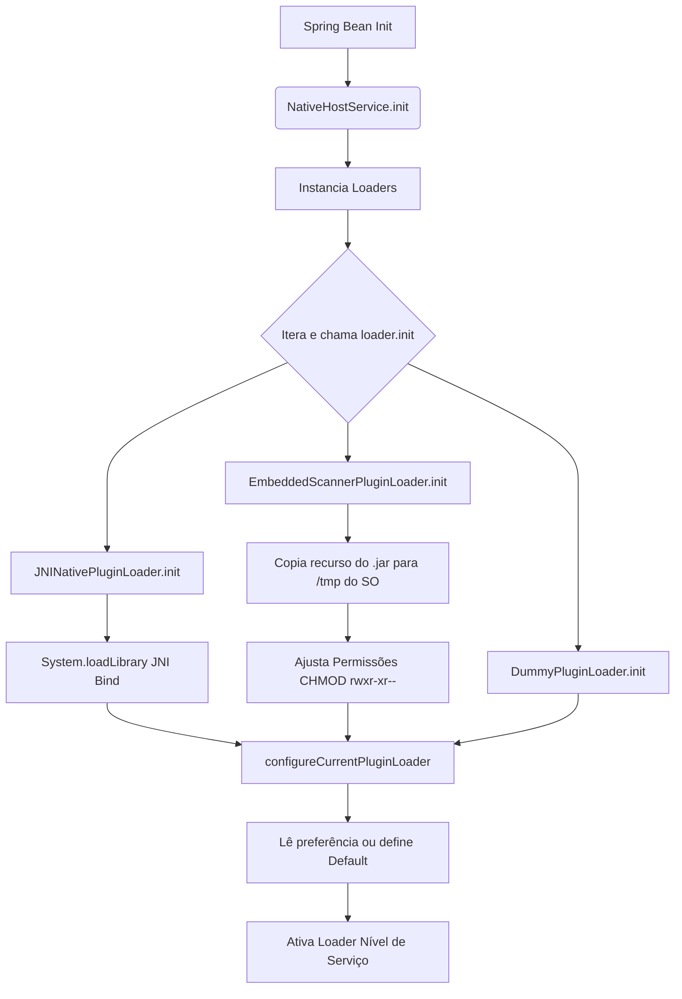

---

### 3.4 Ciclo de Vida Spring: ExploreService.init

- **Localização Exata:** `/owlplug-client/src/main/java/com/owlplug/explore/services/ExploreService.java`
- **Nome da Classe:** `ExploreService`
- **Assinatura do Método:** `@PostConstruct public void init()`
- **Tipo de Gatilho:** Implícito (Spring Lifecycle).
- **Passos do Processamento Interno:**
  1. Verifica através do `RemoteSourceRepository` (banco de dados) se os registros principais ('OwlPlug Registry' e 'Open Audio Stack') já estão salvos.
  2. Se existirem, ele lê as URLs parametrizadas no arquivo `application.yaml` (`@Value("${owlplug.registry.url}")`) e **sobrescreve (UPDATE)** no banco. Isso significa que as URLs contidas no build sempre vencem o estado do DB.
  3. Se não existirem, são criadas entidades `RemoteSource` no DB e persistidas.
- **DB Interactions:** Tabela `REMOTE_SOURCE`. Operações: SELECT, INSERT, UPDATE.
- **Risco:** O código não usa bloco `@Transactional` explícito nesse método de inicialização. Pode haver dirty reads em inicializações muito lentas/paralelas, mas mitigado pelo single-threaded behavior do Spring no startup.

**Fluxograma:**

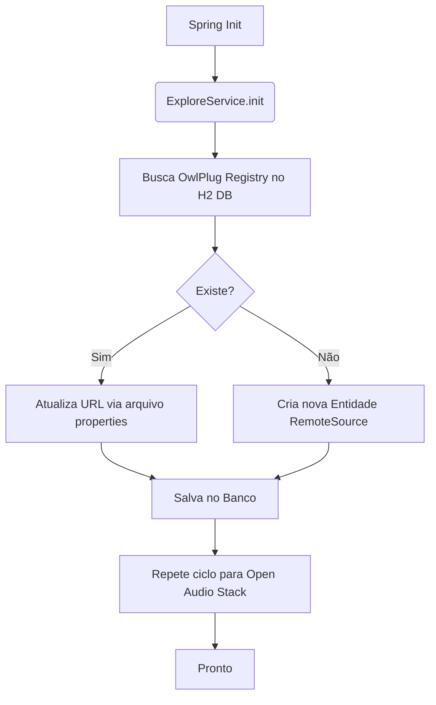

---

### 3.5 Ciclo de Vida Spring: TelemetryService.initialize

- **Localização Exata:** `/owlplug-client/src/main/java/com/owlplug/core/services/TelemetryService.java`
- **Nome da Classe:** `TelemetryService`
- **Assinatura do Método:** `@PostConstruct public void initialize()`
- **Passos do Processamento Interno:**
  1. Acessa chave criptográfica do Mixpanel através da property `owlplug.telemetry.code`.
  2. Cria uma instância do `MessageBuilder` do SDK oficial do Mixpanel.
  3. Verifica se existe um ID de usuário gerado armazenado localmente em `TELEMETRY_UID`.
  4. Se não houver, gera um `UUID.randomUUID().toString()` persistente na máquina para identificação única não-ligada diretamente a dados pessoais.
- **Privacidade e Risco:** Embora ofusque, UUIDs únicos permanentes agem como fingerprints que rastreiam as sessões do usuário persistentemente pela máquina, o que requer clareza nos Termos de Serviço.

**Fluxograma:**

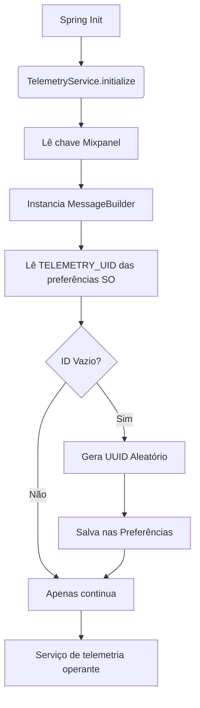

---

### 3.6 Interface de Usuário: MainController.initialize

- **Localização Exata:** `/owlplug-client/src/main/java/com/owlplug/core/controllers/MainController.java`
- **Nome da Classe:** `MainController`
- **Assinatura do Método:** `@FXML public void initialize()`
- **Tipo de Gatilho:** Disparado pelo `FXMLLoader` da engine gráfica JavaFX quando processa o arquivo `MainView.fxml`.
- **Passos do Processamento Interno:**
  1. Inicializa dependência cíclica de gerenciamento de diálogo (`getDialogManager().init(this)`).
  2. Adiciona listeners globais na UI (Tabs). Quando aba selecionada é '2', dispara forced render `exploreController.requestLayout()`.
  3. Registra interceptadores para troca de contas de usuário (Account Combobox).
  4. Define CellFactories personalizadas para botões com imagem.
  5. Inicia e despacha **Task Assíncrona** em thread separada `retrieveUpdateStatusTask` chamando `updateService.isUpToDate()`. Em caso de sucesso, mostra alerta de atualização na view `updatePane`.
- **Side Effects:** Inicia Threads cruas `new Thread(retrieveUpdateStatusTask).start()`. Não utiliza o `TaskRunner` padrão do sistema (ponto de falha arquitetural: escape de thread-pool controlada).
- **Integrações Externas:** Chamada de rede bloqueante disparada para API do GitHub através do UpdateService.
- **DB Interactions:** Nenhuma.

**Fluxograma:**

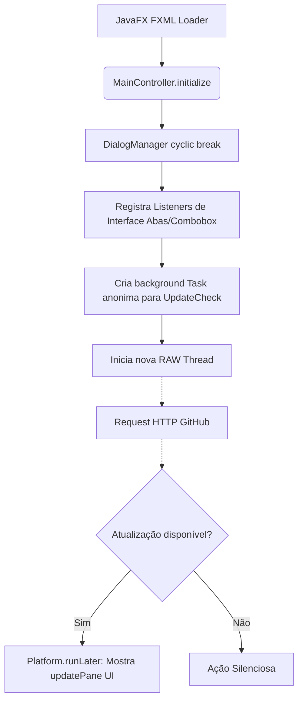

---

### 3.7 Pós-Inicialização Manual: MainController.dispatchPostInitialize

- **Localização Exata:** `/owlplug-client/src/main/java/com/owlplug/core/controllers/MainController.java`
- **Nome da Classe:** `MainController`
- **Assinatura do Método:** `public void dispatchPostInitialize()`
- **Tipo de Gatilho:** Explícito. Chamado por `OwlPlug.init()` logo após a inicialização gráfica ter ocorrido com sucesso.
- **Condicionais e Passos:**
  1. O principal orquestrador pós-boot: Avalia se `applicationMonitor.isPreviousExecutionSafelyTerminated()` retorna false.
  2. Se falso, trava o fluxo abrindo o `crashRecoveryDialogController.show()`.
  3. Se verdadeiro e for o "Primeiro Lançamento" (preferência `FIRST_LAUNCH_KEY`), mostra o `welcomeDialogController.show()` e engatilha **sincronização online silenciosa**: `exploreService.syncSources()`.
  4. Dispara a telemetria enviando evento corporativo de startup: `getTelemetryService().event("/Startup", ...)` inserindo os metadados básicos do SO.
  5. Verifica a configuração de varredura autônoma no startup (`SYNC_PLUGINS_STARTUP_KEY`). Se verdadeiro, invoca de modo assíncrono silencioso: `pluginService.scanPlugins(false)`.
- **Riscos e Performance:**
  - A varredura automática no boot pode iniciar uma travagem massiva de I/O em discos rígidos dependendo do tamanho da biblioteca VST do usuário.
- **Eventos:** Despacha requisição ao Mixpanel.

**Fluxograma:**

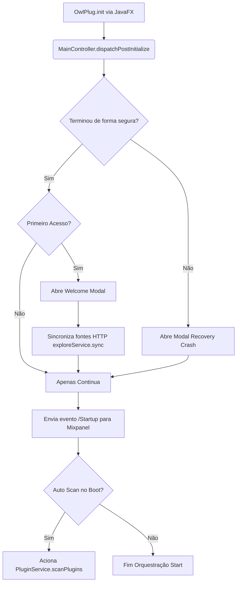

---

### 3.8 Eventos Internos: MainController.onAccountChanged

- **Localização Exata:** `/owlplug-client/src/main/java/com/owlplug/core/controllers/MainController.java`
- **Assinatura:** `@EventListener(AccountChangedEvent.class) public void onAccountChanged()`
- **Tipo de Gatilho:** Barramento de Eventos do Spring (`ApplicationEventPublisher.publishEvent`). Disparado pelo `AuthenticationService` quando um usuário conecta/desconecta do Google OAuth.
- **Processamento:**
  Apenas varre a lista de `UserAccount` na memória e regera os itens estéticos do ComboBox que reflete a interface gráfica do topo da tela.

**Fluxograma:**

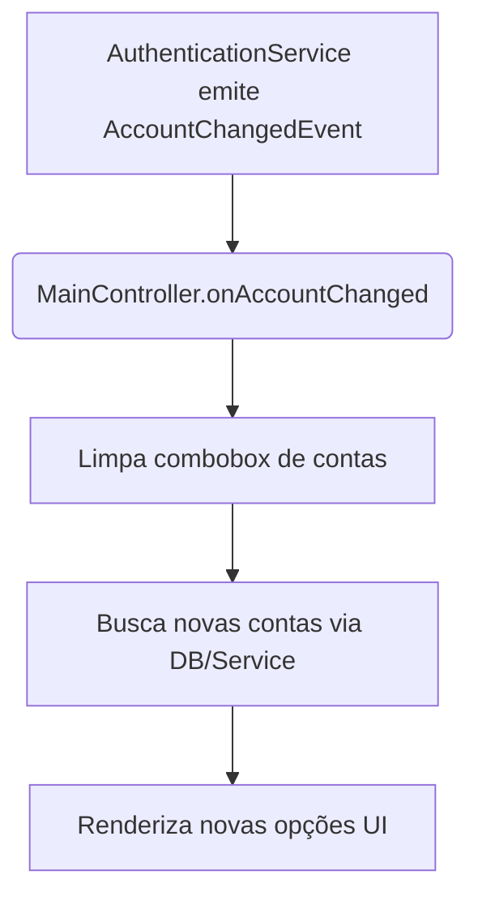

---

### 3.9 Execução de Tarefa Assíncrona: PluginScanTask.call

- **Localização Exata:** `/owlplug-client/src/main/java/com/owlplug/plugin/tasks/PluginScanTask.java`
- **Nome da Classe:** `PluginScanTask` (Herda de `AbstractTask` no framework próprio do app, estende de `javafx.concurrent.Task`).
- **Assinatura do Método:** `public TaskResult call() throws Exception`
- **Tipo de Gatilho:** Adição da task no `TaskRunner` (via interface de usuário clicando em 'Sync' ou trigger de startup).
- **Esquema de Entrada:** Entidades da base contendo dados de pastas mapeadas (VST2, VST3, etc) e flag `differential` (varredura total vs incremental).
- **Lógica de Segurança:** Altíssimo Risco Operacional. Interage profundamente com sistema de arquivos e executa arquivos binários desconhecidos no SO base.
- **Passos do Processamento (Deep Dive):**
  1. Limpa o banco de dados de instâncias prévias dependendo do escopo do Scan (`ScopedScanEntityCollector`).
  2. Varre recursivamente diretórios especificados (via Java NIO `Files.walkFileTree`) em busca de extensões (.vst3, .component, .dll).
  3. Extrai links simbólicos (`.lnk` no Windows, e atalhos POSIX) e os grava na tabela de atalhos.
  4. Para CADA arquivo encontrado, instancia um `Plugin` referencial no DB.
  5. Avalia se a descoberta Nativa (`Native Discovery`) está ativada.
  6. Se estiver, delega o path absoluto do arquivo alienígena recém-descoberto para `NativeHostService.getPluginLoader().loadPlugin(path)`.
     - *Neste momento crasso, o processo C++ "Scanner" (discutido no 3.3) abre o arquivo de áudio desconhecido na memória e envia buffers binários para interrogar sua árvore de propriedades (Nome, Versão, Parametros). Se o VST contiver exploit de overflow no inicializador C++ dele, o Scanner irá estourar.*
  7. A resposta do binário é recebida (via Pipe stdout em formato XML, delimitado por strings fixas na camada do `EmbeddedScannerPluginLoader`).
  8. O XML é transformado em metadados injetados na entidade `PluginComponent` no H2.
- **Transação:** Não engloba a execução inteira num bloco JPA, cria gargalos de commit iterativos (um update por arquivo), causando overhead I/O considerável.
- **Exceptions:** Trata falhas parciais (Falha em ler 1 VST isolado não derruba a tarefa, ele registra como inválido e vai pro próximo).

**Fluxograma:**

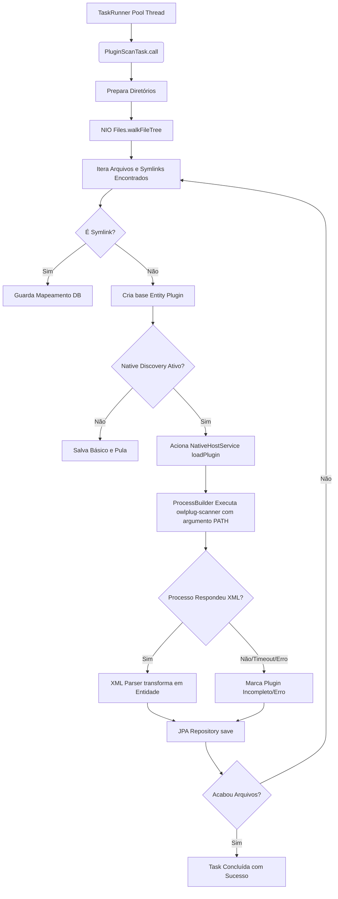

---

### 3.10 Execução de Tarefa Assíncrona: BundleInstallTask.call

- **Localização Exata:** `/owlplug-client/src/main/java/com/owlplug/explore/tasks/BundleInstallTask.java`
- **Nome da Classe:** `BundleInstallTask`
- **Assinatura do Método:** `public TaskResult call() throws Exception`
- **Tipo de Gatilho:** Usuário solicitando instalação de um Plugin vindo do `ExploreController` (Store Remota).
- **Esquema de Entrada:** Instância de `PackageBundle` (URL de download remota, Hash SHA256 esperado e formatos suportados).
- **Validação e Segurança:**
  - Baixa um arquivo `.zip` remoto usando `HttpClient`.
  - Verifica o hash computado (`DigestUtils.sha256Hex`) contra o hash esperado.
  - *Vulnerabilidade Zip Slip Analisada:* O arquivo usa Apache Commons Compress. O desenvolvedor deve se assegurar que o método de descompressão valida se os caminhos no arquivo zipado não tentam saltar pastas (ex: `../../../../etc/passwd`). A implementação nativa não é inteiramente segura se a camada de abstração falhar nessa verificação de path traversal.
- **Passos Internos:**
  1. Faz download para pasta `/temp` local.
  2. Executa cálculo criptográfico SHA-256 no InputStream em buffer. Rejeita o arquivo e apaga silenciosamente se não bater com a assinatura do Registry.
  3. Descompacta e analisa a estrutura interna via Heurística Customizada (`Determine Structure Type`), pois autores empacotam de forma irregular.
  4. Move o subdiretório válido extraído para a pasta raiz global de plugins correspondente da máquina (`/Library/Audio/Plug-Ins` no Mac ou `C:/Program Files/Common Files/VST3` no Win).
  5. Apaga vestígios na `/temp`.

**Fluxograma:**

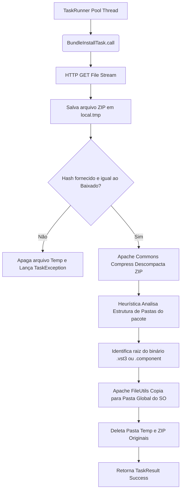

---

### 3.11 Desligamento da Aplicação: ApplicationMonitor.shutdown

- **Localização Exata:** `/owlplug-client/src/main/java/com/owlplug/core/components/ApplicationMonitor.java`
- **Nome da Classe:** `ApplicationMonitor`
- **Assinatura do Método:** `@PreDestroy public void shutdown()`
- **Tipo de Gatilho:** Desligamento orquestrado da JVM (Interrupção de janela, SIGTERM ou comando nativo via Spring `Context.close()`).
- **Passos do Processamento Interno:**
  1. Acessa as preferências globais do OS local.
  2. Modifica o campo `APPLICATION_STATE_KEY` de `RUNNING` para `TERMINATED`.
- **Efeitos Colaterais:** Permite que o próximo processo (mesmo que seja uma reinicialização de crash) saiba que o fim foi gracioso, inibindo o popup de recovery descrito na fase 3.7.

**Fluxograma:**

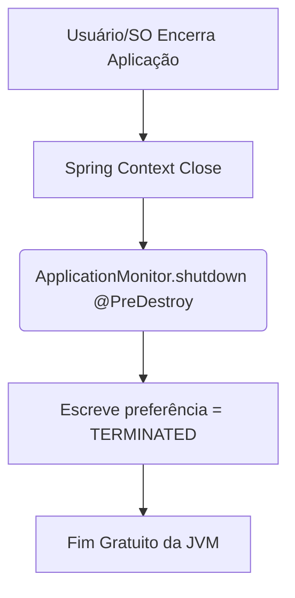

---

## 4. Análises Adicionais

### 4.1 Identificação de Código Morto (Dead Code)
- A classe base e seus métodos do pacote legado `JNINativePluginLoader` contêm declarações metodológicas inúteis não engatilhadas de lugar algum na prática comum se o modo Embedded for ativado (`open()` e `close()` vazios).
- Existem variáveis `@Deprecated` mapeadas na estrutura das entidades como `RemotePackage.downloadUrl` que se mantém na base H2 inflando tamanho sem utilidade efetiva, já substituídas logicamente por agregações na entidade Bundle.

### 4.2 Riscos de Acoplamento e Concorrência
- Existe um nível massivo de acoplamento direto nas tarefas assíncronas do pacote `tasks` que atuam diretamente nos repósitorios Spring Data (JPA). Não há camada de abstração (DTO) forte nos processos massivos do banco. Como as `Tasks` vivem em Threads separadas (ThreadPool JavaFX), transações preguiçosas JPA (Lazy Loading) tendem a arremessar `LazyInitializationException` se os relacionamentos mestre-detalhe (Ex: O Bundle pertencente a um Pacote) precisarem ser abertos sem uma transação explicitamente aberta em torno do método `call()` da tarefa.

### 4.3 Violação de Escopo de Gerenciador (Thread Pool Evasion)
- O `MainController.java` possui um código que inicializa a Thread assíncrona para check de update utilizando a API C-Style primária de concorrência: `new Thread(retrieveUpdateStatusTask).start()`. Esse padrão falha ao fugir do `TaskRunner` injetado via Spring que o sistema OwlPlug designou para rastrear tarefas. O escape cria "threads orfãs" em um desligamento do Spring.

### 4.4 Limites de Transação Inconsistentes (Transaction Boundaries)
- Tarefas de longa duração (Ex: `SourceSyncTask` que apaga repositórios inteiros e re-insere baseada numa API JSON HTTP) não estão anotadas com `@Transactional` ao nível do job inteiro. Se um parse falhar no meio (ex, json inválido no item 5 de 100), o sistema pode manter os 4 primeiros salvos e o resto incompleto, rompendo integridade atômica do cache local.
- Sugestão mandatória: Extração de todos os `repo.save()` e `repo.delete()` dentro de tasks pesadas para métodos anotados com `@Transactional(propagation = Propagation.REQUIRES_NEW)` vivendo dentro de Serviços dedicados.

### 4.5 Riscos de Segurança (Autenticação Google)
O código aponta interações complexas no módulo `auth` (`AuthenticationService`):
1. **LocalServerReceiver Leak:** A API do Google devolve o `auth_code` através de um redirecionamento para o IP `localhost`. Se outra aplicação na máquina estiver escutando propositalmente na porta escolhida pelo OwlPlug, tokens podem ser roubados (Cross-Site Request Forgery mitigado levemente por loopback).
2. **Tokens sem Criptografia:** O banco H2 não suporta encriptação nativa por coluna e salva os dados em disco. O Refresh Token do Google vive debaixo dos olhos puros no diretório do usuário (`~/.owlplug/db.*`). Qualquer malware simples de desktop logado extrai essas permissões completas, garantindo acesso à API do Google atrelado ao perfil. O recomendável é usar Keychains ou Vaults do SO.

**Fim da Auditoria Forense.** As recomendações englobam revisão completa do mecanismo Native Loader para operar através de Sandboxing, implementação de limites transacionais estritos (Atomicidade) para Tasks Longas que afetam o H2, e limpeza profunda nas interações assíncronas não-transacionais que interagem em cima do banco H2 e processos pesados.

---
**Nota Paranoica Final:** Um app de gerenciamento de binários executáveis é atraente como vetor primário de injeção em cadeias produtivas (Supply Chain Attack) para estúdios profissionais que processam áudio em larga escala. Todos os binários manipulados devem possuir atestado rígido via assinatura e a manipulação do sistema de arquivos restrita por perfis de execução rebaixada (AppArmor ou equivalentes sempre que instalados).