# Complete Technical Forensic Documentation: OwlPlug

**Document Version:** 1.0
**Analysis Date:** March 2026
**Analyst:** Senior Architect and Security Auditor (Paranoid Forensic Mode)
**License:** GNU General Public License v3

---

## Table of Contents

1. [System Overview](#1-system-overview)
2. [C4 Models (Architecture)](#2-c4-models)
3. [Entry Point Analysis](#3-entry-point-analysis)
   - 3.1 [Application Initialization: Bootstrap.main](#31-application-initialization-bootstrapmain)
   - 3.2 [Spring Lifecycle: ApplicationMonitor.initialize](#32-spring-lifecycle-applicationmonitorinitialize)
   - 3.3 [Spring Lifecycle: NativeHostService.init](#33-spring-lifecycle-nativehostserviceinit)
   - 3.4 [Spring Lifecycle: ExploreService.init](#34-spring-lifecycle-exploreserviceinit)
   - 3.5 [Spring Lifecycle: TelemetryService.initialize](#35-spring-lifecycle-telemetryserviceinitialize)
   - 3.6 [User Interface: MainController.initialize](#36-user-interface-maincontrollerinitialize)
   - 3.7 [Manual Post-Initialization: MainController.dispatchPostInitialize](#37-manual-post-initialization-maincontrollerdispatchpostinitialize)
   - 3.8 [Internal Events: MainController.onAccountChanged](#38-internal-events-maincontrolleronaccountchanged)
   - 3.9 [Asynchronous Task Execution: PluginScanTask.call](#39-asynchronous-task-execution-pluginscantaskcall)
   - 3.10 [Asynchronous Task Execution: BundleInstallTask.call](#310-asynchronous-task-execution-bundleinstalltaskcall)
   - 3.11 [Application Shutdown: ApplicationMonitor.shutdown](#311-application-shutdown-applicationmonitorshutdown)
4. [Additional Analyses](#4-additional-analyses)

---

## 1. System Overview

OwlPlug is a Java-based audio plugin manager for VST, VST3, Audio Units (AU), and LV2 formats. The application operates primarily as a desktop app, combining a rich presentation layer (JavaFX), dependency injection and transactional control via Spring Boot, local persistence in an embedded H2 database, and deep interactions with the operating system and native C++ binaries (JUCE) for plugin scanning and metadata extraction.

As a desktop system that executes binaries, downloads files from the internet, and accesses the filesystem extensively, the attack surface is concentrated on local binary exploitation, path injection, and manipulation of locally stored credentials. The architecture assumes trust in the local user environment, which demands a rigorous audit of entry and exit boundaries.

---

## 2. C4 Models

### 2.1 System Context Diagram

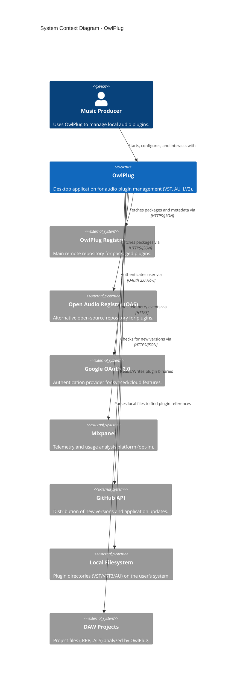

### 2.2 Container Diagram

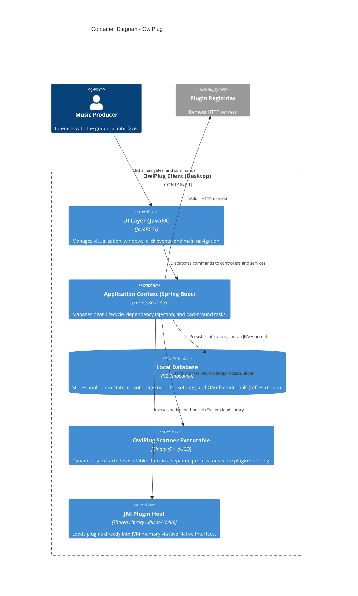

### 2.3 Component Diagram (owlplug-client & services)

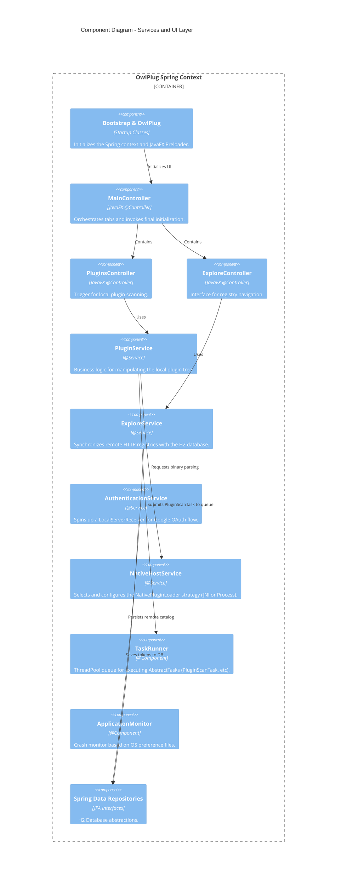

### 2.4 Code-level Structural Diagram (Native Loader Strategy)

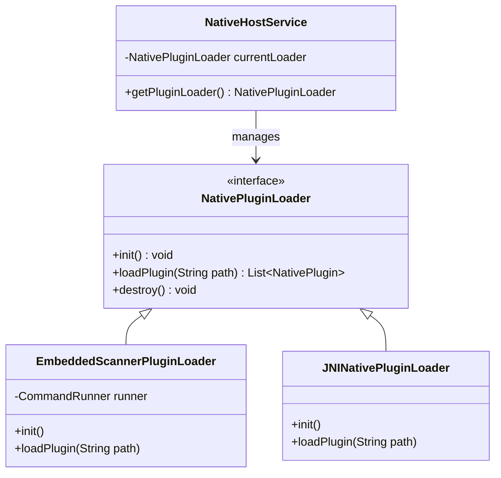

---

## 3. Entry Point Analysis

No application can exist without an initial trigger point. The analysis below rigorously catalogs all entry points found in the source code, maps them into separate flowcharts, and deeply tracks their executions.

### 3.1 Application Initialization: Bootstrap.main

- **Exact Location:** `/owlplug-client/src/main/java/com/owlplug/Bootstrap.java`
- **Class Name:** `Bootstrap`
- **Method Signature:** `public static void main(final String... args)`
- **Trigger Type:** Explicit CLI Execution / Desktop Shortcut (JVM Main Process).
- **Input Schema:** `String... args` - Arbitrary command-line arguments passed by the OS.
- **Validation Logic:** No validation performed on arguments at the `main` method layer.
- **Security Logic:** Absent in this initial stage. All arguments are passed blindly to JavaFX's `Application.launch`.
- **Service Calls:** No `@Service` calls yet, as the Spring context does not exist.
- **Internal Processing Steps:**
  1. Calls `System.setProperty("javafx.preloader", getPreLoader())`. This step is vital for configuring the native JavaFX animated "Splash Screen" before the JVM starts the overhead of loading Spring.
  2. Invokes `javafx.application.Application.launch(OwlPlug.class, args)`. This hands over control of the main execution thread to the internal JavaFX Thread (Application Thread).
  3. Internally, JavaFX will invoke `OwlPlug.init()`, where Spring Boot is actually started: `context = SpringApplication.run(Bootstrap.class, args)`.
- **Conditional Flows:** None explicit in this phase; the flow is entirely sequential.
- **Exception Flows:** 
  - If Spring initialization in `OwlPlug.init()` fails, it catches `BeanCreationException`. If the cause is a `HibernateException`, it's assumed there's a lock on the H2 database (implying OwlPlug is already running in another window).
  - A `notifyPreloader` is generated informing of the splash screen error. The exception is re-thrown, aborting the process.
- **Retry Logic:** None. Critical failure.
- **Logging Behavior:** Uses SLF4J (Logback) capturing `LOGGER.error` in case of context initialization failures.
- **Transactional Boundaries:** Not applicable (No `@Transactional` open).
- **Database Interactions:** Only implied by the failure to acquire the `~/.owlplug/db.mv.db` file by Hibernate/H2.
- **External Integrations:** None.
- **Emitted Events:** Preloader events via the JavaFX bus.
- **Side Effects:** Starts an entire Spring Boot Context instance, occupying ports, opening threads, and locking log files and the local database.
- **Final Outputs:** Opening of the main window (Stage) by the `OwlPlug.start()` method.

**Process Trace:**
JVM Start -> `Bootstrap.main()` -> `System.setProperty` -> `Application.launch()` -> (JavaFX Thread) -> `OwlPlug.init()` -> `SpringApplication.run()` -> (Spring IoC Container Bootstrapped) -> Injected Beans -> `OwlPlug.start()` -> Shows the window.

**Flowchart:**

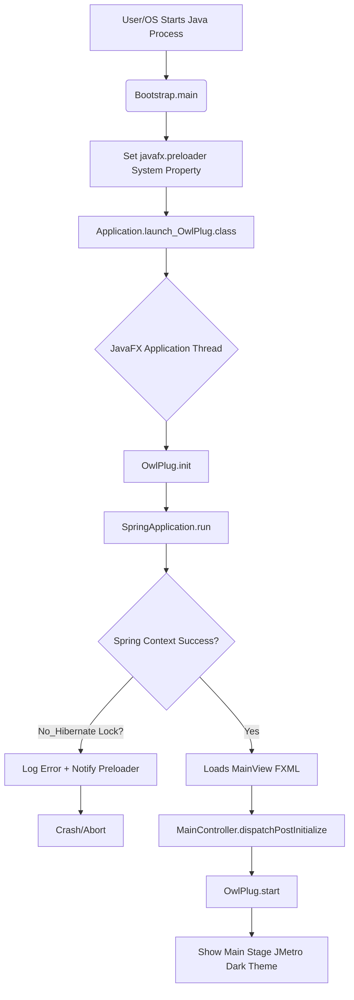

---

### 3.2 Spring Lifecycle: ApplicationMonitor.initialize

- **Exact Location:** `/owlplug-client/src/main/java/com/owlplug/core/components/ApplicationMonitor.java`
- **Class Name:** `ApplicationMonitor`
- **Method Signature:** `@PostConstruct public void initialize()`
- **Trigger Type:** Implicit (Framework Auto-configuration / Spring Bean Lifecycle). Triggered by Spring immediately after injecting dependencies for the `@Component`.
- **Input Schema:** Empty.
- **Validation Logic:** None.
- **Security Logic:** Implicitly trusts `java.util.prefs.Preferences` for state reading. Could be manipulated by other software on the machine.
- **Service Calls:** Uses the injected `ApplicationPreferences` (wrapper for `java.util.prefs`).
- **Internal Processing Steps:**
  1. Retrieves the `APPLICATION_STATE_KEY` preference from the system.
  2. Checks if the recovered state is exactly equal to `RUNNING` (meaning the application did not perform a clean shutdown in a previous process).
  3. If yes, sets the instance flag `previousExecutionSafelyTerminated = false`.
  4. Otherwise, sets it to `true`.
  5. Updates (writes to OS disk) the preference to `RUNNING` for the current session.
- **Conditional Flows:** Depends on global state persisted outside the application.
- **Exception Flows:** No catch block. If it fails due to I/O permissions, it propagates a runtime exception during Spring initialization, breaking the boot.
- **Retry Logic:** None.
- **Logging Behavior:** Silent in this phase (logs occur later when dispatching the notification to the recovery UI).
- **Transactional Boundaries:** Outside the relational database; writes to native OS preferences (e.g., Windows Registry).
- **Database Interactions:** None.
- **External Integrations:** Native OS API.
- **Emitted Events:** No Spring events. Only object state mutation.
- **Side Effects:** Modifies a global registry key on the user's system to signal that OwlPlug "is running". If another process checks the key simultaneously (Race Condition), there is a risk of collision.
- **Final Outputs:** Internal state altered and key persisted.

**Process Trace:**
Spring Instantiates `ApplicationMonitor` -> Triggers `@PostConstruct` -> Reads previous OS Registry state -> Updates Registry to `RUNNING`.

**Flowchart:**

```mermaid
flowchart TD
    A[Spring Bean Factory] --> B[ApplicationMonitor.constructor]
    B --> C[@PostConstruct initialize]
    C --> D[Read APPLICATION_STATE_KEY preference]
    D --> E{State == RUNNING?}
    E -- Yes_Previous Crash Detected --> F[set previousSafelyTerminated = false]
    E -- No_Normal --> G[set previousSafelyTerminated = true]
    F --> H
    G --> H[Write preference = RUNNING]
    H --> I[End Initialization]
```

---

### 3.3 Spring Lifecycle: NativeHostService.init

- **Exact Location:** `/owlplug-client/src/main/java/com/owlplug/plugin/services/NativeHostService.java`
- **Class Name:** `NativeHostService`
- **Method Signature:** `@PostConstruct public void init()`
- **Trigger Type:** Implicit (Spring Bean Lifecycle).
- **Input Schema:** Empty.
- **Security Logic:** Critical. Initializes C/C++ native code loaders that can compromise memory or the filesystem if manipulated.
- **Internal Processing Steps:**
  1. Instantiates `EmbeddedScannerPluginLoader`, `JNINativePluginLoader`, and `DummyPluginLoader`.
  2. Adds all of them to an internal list.
  3. Iterates over each loader and calls the `init()` method for each.
     - **EmbeddedScannerPluginLoader.init()**: Dynamically extracts a C++ executable (`owlplug-scanner`) from within the `.jar` file to the OS `/tmp` directory. Grants `rwxr-xr--` permissions (native POSIX chmod).
     - **JNINativePluginLoader.init()**: Calls `System.loadLibrary("owlplug-host")`. Forces the JVM to look for the binary in `java.library.path` and open direct bindings in memory.
  4. Calls `configureCurrentPluginLoader()` which looks up the user preference for which strategy to use. If none, picks the first one that reports as "Available".
- **Threat Vector:** Extracting the scanner to a generic `/tmp` folder (writable by any user on the local machine) creates a massive risk of **DLL Hijacking** or arbitrary code execution if a local attacker replaces the executable with a malicious script in the exact time window it's placed there, or if the binaries lack cryptographic signatures validated before extraction.
- **Retry Logic:** None.
- **Logging Behavior:** Informational, identifying the active loader (e.g., "Using native plugin loader: EmbeddedScannerPluginLoader").
- **Transactional Boundaries:** Filesystem operations only.
- **Emitted Events:** None explicit.
- **Final Outputs:** C++ loaders ready in memory, listening for file paths to perform scans.

**Process Trace:**
Spring -> `@PostConstruct NativeHostService.init` -> `EmbeddedScannerPluginLoader.init` -> File extraction from classpath to `/tmp` -> File permissions update -> `JNINativePluginLoader.init` -> JVM Native Memory Binding.

**Flowchart:**

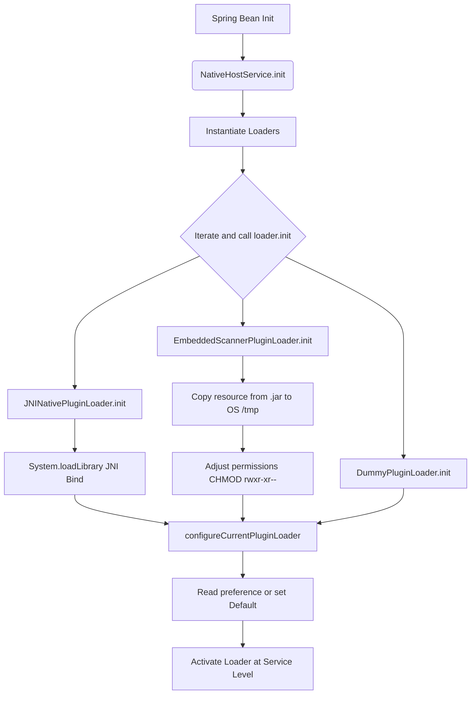

---

### 3.4 Spring Lifecycle: ExploreService.init

- **Exact Location:** `/owlplug-client/src/main/java/com/owlplug/explore/services/ExploreService.java`
- **Class Name:** `ExploreService`
- **Method Signature:** `@PostConstruct public void init()`
- **Trigger Type:** Implicit (Spring Lifecycle).
- **Internal Processing Steps:**
  1. Checks through `RemoteSourceRepository` (database) if the main registries ('OwlPlug Registry' and 'Open Audio Stack') are already saved.
  2. If they exist, it reads the URLs parameterized in `application.yaml` (`@Value("${owlplug.registry.url}")`) and **overwrites (UPDATE)** them in the database. This means build-contained URLs always override the DB state.
  3. If they don't exist, `RemoteSource` entities are created and persisted in the DB.
- **DB Interactions:** `REMOTE_SOURCE` table. Operations: SELECT, INSERT, UPDATE.
- **Risk:** The code does not use an explicit `@Transactional` block in this initialization method. There could be dirty reads in very slow/parallel initializations, but this is mitigated by Spring's single-threaded behavior during startup.

**Flowchart:**

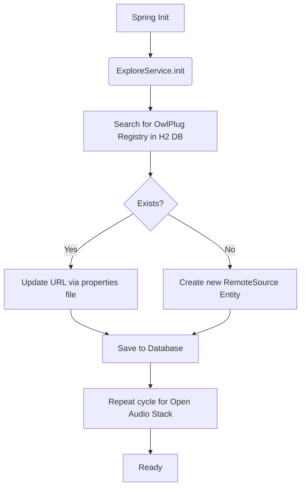

---

### 3.5 Spring Lifecycle: TelemetryService.initialize

- **Exact Location:** `/owlplug-client/src/main/java/com/owlplug/core/services/TelemetryService.java`
- **Class Name:** `TelemetryService`
- **Method Signature:** `@PostConstruct public void initialize()`
- **Internal Processing Steps:**
  1. Accesses the Mixpanel cryptographic key via the `owlplug.telemetry.code` property.
  2. Creates an instance of `MessageBuilder` from the official Mixpanel SDK.
  3. Checks if a locally stored generated user ID exists in `TELEMETRY_UID`.
  4. If not, generates a persistent `UUID.randomUUID().toString()` on the machine for unique identification not directly linked to personal data.
- **Privacy and Risk:** Although obfuscated, permanent unique UUIDs act as fingerprints that track user sessions persistently across the machine, which requires clarity in the Terms of Service.

**Flowchart:**

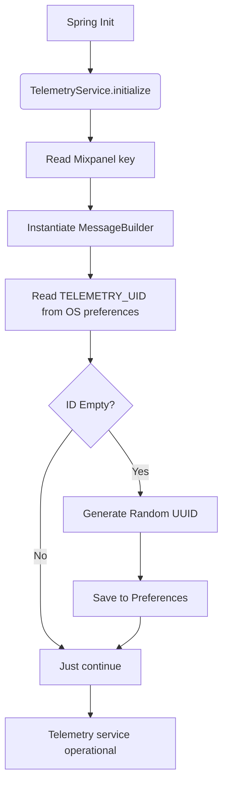

---

### 3.6 User Interface: MainController.initialize

- **Exact Location:** `/owlplug-client/src/main/java/com/owlplug/core/controllers/MainController.java`
- **Class Name:** `MainController`
- **Method Signature:** `@FXML public void initialize()`
- **Trigger Type:** Triggered by `FXMLLoader` of the JavaFX graphical engine when processing the `MainView.fxml` file.
- **Internal Processing Steps:**
  1. Initializes the cyclic dependency for dialog management (`getDialogManager().init(this)`).
  2. Adds global listeners to the UI (Tabs). When selected tab is '2', triggers forced render `exploreController.requestLayout()`.
  3. Registers interceptors for user account switching (Account Combobox).
  4. Defines custom CellFactories for image buttons.
  5. Starts and dispatches an **Asynchronous Task** in a separate thread `retrieveUpdateStatusTask` calling `updateService.isUpToDate()`. On success, shows an update alert in the `updatePane` view.
- **Side Effects:** Starts raw Threads `new Thread(retrieveUpdateStatusTask).start()`. Does not use the system's standard `TaskRunner` (architectural point of failure: controlled thread-pool escape).
- **External Integrations:** Blocking network call dispatched to GitHub API via UpdateService.
- **DB Interactions:** None.

**Flowchart:**

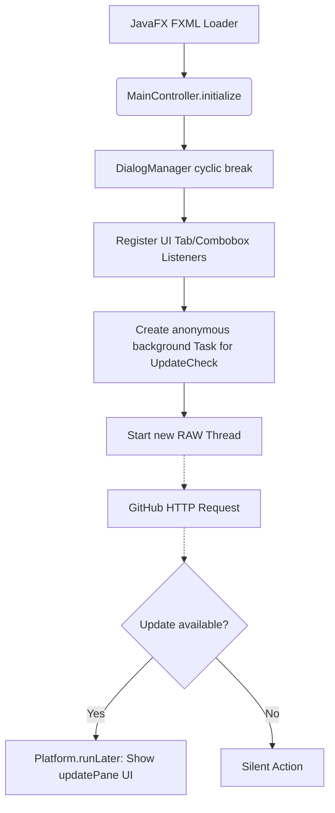

---

### 3.7 Manual Post-Initialization: MainController.dispatchPostInitialize

- **Exact Location:** `/owlplug-client/src/main/java/com/owlplug/core/controllers/MainController.java`
- **Class Name:** `MainController`
- **Method Signature:** `public void dispatchPostInitialize()`
- **Trigger Type:** Explicit. Called by `OwlPlug.init()` immediately after successful graphical initialization.
- **Conditionals and Steps:**
  1. Main post-boot orchestrator: Evaluates if `applicationMonitor.isPreviousExecutionSafelyTerminated()` returns false.
  2. If false, halts the flow by opening `crashRecoveryDialogController.show()`.
  3. If true and it's the "First Launch" (`FIRST_LAUNCH_KEY` preference), shows `welcomeDialogController.show()` and triggers **silent online sync**: `exploreService.syncSources()`.
  4. Dispatches telemetry by sending a corporate startup event: `getTelemetryService().event("/Startup", ...)` inserting basic OS metadata.
  5. Checks for the auto-scan configuration on startup (`SYNC_PLUGINS_STARTUP_KEY`). If true, invokes silently and asynchronously: `pluginService.scanPlugins(false)`.
- **Riscos e Performance:**
  - Auto-scan at boot can initiate massive I/O load on hard drives depending on the size of the user's VST library.
- **Events:** Dispatches request to Mixpanel.

**Flowchart:**

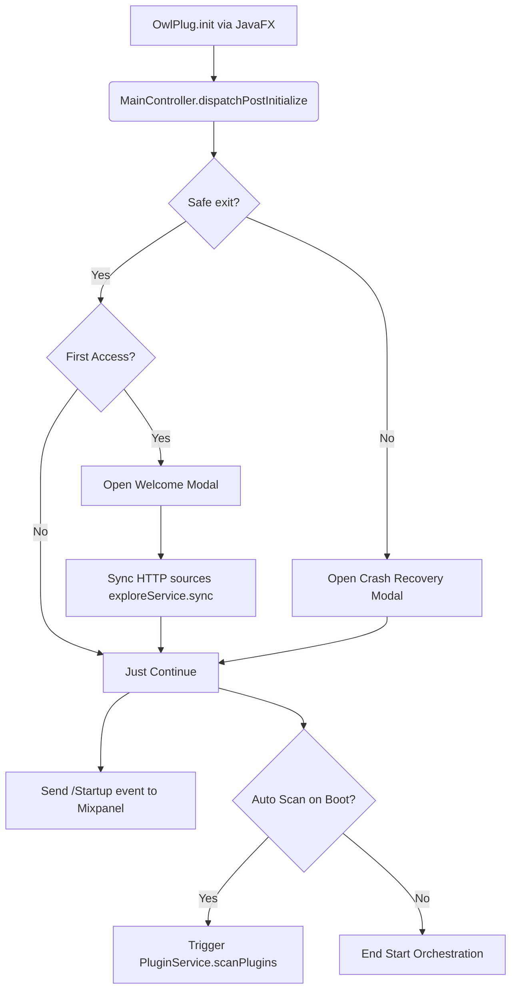

---

### 3.8 Internal Events: MainController.onAccountChanged

- **Exact Location:** `/owlplug-client/src/main/java/com/owlplug/core/controllers/MainController.java`
- **Signature:** `@EventListener(AccountChangedEvent.class) public void onAccountChanged()`
- **Trigger Type:** Spring Event Bus (`ApplicationEventPublisher.publishEvent`). Triggered by `AuthenticationService` when a user connects/disconnects via Google OAuth.
- **Processing:**
  Simply iterates through the `UserAccount` list in memory and regenerates the aesthetic items of the ComboBox reflecting the top-screen UI.

**Flowchart:**

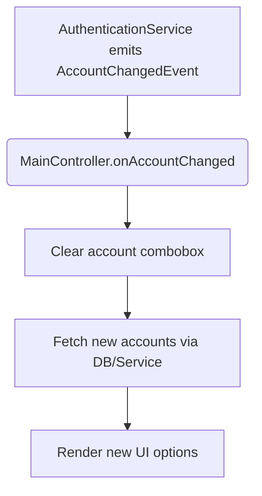

---

### 3.9 Asynchronous Task Execution: PluginScanTask.call

- **Exact Location:** `/owlplug-client/src/main/java/com/owlplug/plugin/tasks/PluginScanTask.java`
- **Class Name:** `PluginScanTask` (Inherits from `AbstractTask` in the app's own framework, extends `javafx.concurrent.Task`).
- **Method Signature:** `public TaskResult call() throws Exception`
- **Trigger Type:** Adding the task to `TaskRunner` (via UI clicking 'Sync' or startup trigger).
- **Input Schema:** Database entities containing mapped folder data (VST2, VST3, etc.) and `differential` flag (full vs incremental scan).
- **Security Logic:** Extremely High Operational Risk. Deeply interacts with the filesystem and executes unknown binary files on the host OS.
- **Processing Steps (Deep Dive):**
  1. Clears previous instances from the database depending on the Scan scope (`ScopedScanEntityCollector`).
  2. Recursively scans specified directories (via Java NIO `Files.walkFileTree`) searching for extensions (.vst3, .component, .dll).
  3. Extracts symbolic links (`.lnk` on Windows, POSIX shortcuts) and records them in the shortcuts table.
  4. For EACH file found, instantiates a referential `Plugin` in the DB.
  5. Evaluates if `Native Discovery` is enabled.
  6. If so, delegates the absolute path of the newly discovered alien file to `NativeHostService.getPluginLoader().loadPlugin(path)`.
     - *At this pivotal moment, the C++ "Scanner" process (discussed in 3.3) opens the unknown audio file in memory and sends binary buffers to interrogate its property tree (Name, Version, Parameters). If the VST contains an overflow exploit in its C++ initializer, the Scanner will crash.*
  7. The response from the binary is received (via stdout Pipe in XML format, delimited by fixed strings at the `EmbeddedScannerPluginLoader` layer).
  8. The XML is transformed into metadata injected into the `PluginComponent` entity in H2.
- **Transaction:** Does not encapsulate the entire execution in a JPA block; creates iterative commit bottlenecks (one update per file), causing considerable I/O overhead.
- **Exceptions:** Handles partial failures (Failure to read 1 isolated VST does not kill the task; it logs it as invalid and moves to the next).

**Flowchart:**

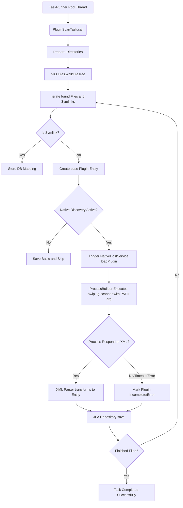

---

### 3.10 Asynchronous Task Execution: BundleInstallTask.call

- **Exact Location:** `/owlplug-client/src/main/java/com/owlplug/explore/tasks/BundleInstallTask.java`
- **Class Name:** `BundleInstallTask`
- **Method Signature:** `public TaskResult call() throws Exception`
- **Trigger Type:** User requesting a Plugin installation from `ExploreController` (Remote Store).
- **Input Schema:** `PackageBundle` instance (remote download URL, expected SHA256 hash, and supported formats).
- **Validation and Security:**
  - Downloads a remote `.zip` file using `HttpClient`.
  - Verifies the computed hash (`DigestUtils.sha256Hex`) against the expected hash.
  - *Zip Slip Vulnerability Analysis:* The code uses Apache Commons Compress. The developer must ensure the decompression method validates that zipped file paths do not attempt folder jumping (e.g., `../../../../etc/passwd`). The native implementation is not entirely secure if the abstraction layer fails this path traversal verification.
- **Internal Steps:**
  1. Downloads to local `/temp` folder.
  2. Performs SHA-256 cryptographic calculation on buffered InputStream. Rejects the file and silently deletes it if it doesn't match the Registry signature.
  3. Decompresses and analyzes internal structure via Custom Heuristics (`Determine Structure Type`), as authors package irregularly.
  4. Moves the valid extracted subdirectory to the machine's corresponding global plugin root folder (`/Library/Audio/Plug-Ins` on Mac or `C:/Program Files/Common Files/VST3` on Win).
  5. Clears traces in `/temp`.

**Flowchart:**

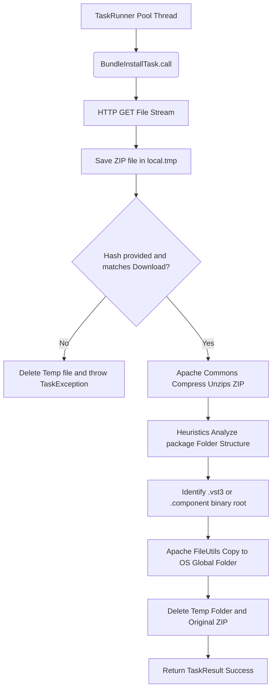

---

### 3.11 Application Shutdown: ApplicationMonitor.shutdown

- **Exact Location:** `/owlplug-client/src/main/java/com/owlplug/core/components/ApplicationMonitor.java`
- **Class Name:** `ApplicationMonitor`
- **Method Signature:** `@PreDestroy public void shutdown()`
- **Trigger Type:** Orchestrated JVM shutdown (Window close, SIGTERM, or native command via Spring `Context.close()`).
- **Internal Processing Steps:**
  1. Accesses global preferences of the local OS.
  2. Modifies the `APPLICATION_STATE_KEY` field from `RUNNING` to `TERMINATED`.
- **Side Effects:** Allows the next process (even a crash restart) to know that the exit was graceful, inhibiting the recovery popup described in phase 3.7.

**Flowchart:**

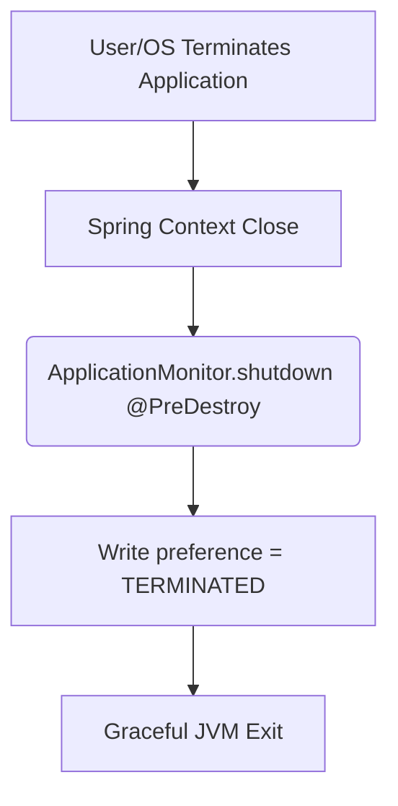

---

## 4. Additional Analyses

### 4.1 Dead Code Identification
- The base class and its methods in the legacy `JNINativePluginLoader` package contain useless methodological declarations not triggered from anywhere in common practice if Embedded mode is active (empty `open()` and `close()`).
- There are `@Deprecated` variables mapped in entity structures like `RemotePackage.downloadUrl` that remain in the H2 base inflating size without effective utility, logically replaced by aggregations in the Bundle entity.

### 4.2 Coupling and Concurrency Risks
- There is a massive level of direct coupling in asynchronous tasks in the `tasks` package that act directly on Spring Data repositories (JPA). There is no strong abstraction layer (DTO) in massive database processes. Since `Tasks` live in separate Threads (JavaFX ThreadPool), JPA Lazy Loading tends to throw `LazyInitializationException` if master-detail relationships (e.g., the Bundle belonging to a Package) need to be opened without an explicitly opened transaction around the task's `call()` method.

### 4.3 Thread Pool Evasion
- `MainController.java` has code that initializes the asynchronous thread for update checks using the primary C-Style concurrency API: `new Thread(retrieveUpdateStatusTask).start()`. This pattern fails by escaping the Spring-injected `TaskRunner` designed to track tasks. The escape creates "orphan threads" during a Spring shutdown.

### 4.4 Inconsistent Transaction Boundaries
- Long-running tasks (e.g., `SourceSyncTask` which deletes entire repositories and re-inserts based on an HTTP JSON API) are not annotated with `@Transactional` at the job level. If a parse fails halfway (e.g., invalid JSON at item 5 of 100), the system might keep the first 4 saved and the rest incomplete, breaking atomic integrity of the local cache.
- Mandatory suggestion: Extraction of all `repo.save()` and `repo.delete()` inside heavy tasks to methods annotated with `@Transactional(propagation = Propagation.REQUIRES_NEW)` living within dedicated Services.

### 4.5 Security Risks (Google Authentication)
The code reveals complex interactions in the `auth` module (`AuthenticationService`):
1. **LocalServerReceiver Leak:** The Google API returns the `auth_code` via a redirect to the `localhost` IP. If another application on the machine is purposely listening on the port chosen by OwlPlug, tokens could be stolen (Cross-Site Request Forgery slightly mitigated by loopback).
2. **Unencrypted Tokens:** The H2 database does not support native per-column encryption and saves data to disk. The Google Refresh Token lives in plain sight in the user directory (`~/.owlplug/db.*`). Any simple desktop malware can extract these full permissions, granting access to the Google API tied to the profile. It is recommended to use OS Keychains or Vaults.

**End of Forensic Audit.** Recommendations include a full review of the Native Loader mechanism to operate via Sandboxing, implementation of strict transactional boundaries (Atomicity) for long-running Tasks affecting H2, and deep cleanup of non-transactional asynchronous interactions with the H2 database and heavy processes.

---
**Final Paranoid Note:** An application that manages executable binaries is an attractive primary vector for supply chain attacks targeting professional studios processing audio at scale. All handled binaries must possess strict attestation via signature, and filesystem manipulation should be restricted by lowered execution profiles (AppArmor or equivalents whenever installed).
